<div align="center">

<sub>INDEPENDENT DESIGN PRACTICE · AI-ASSISTED PRODUCT WORK</sub>

# Apple-Design

### From intent to interface.

Turn design principles into executable pages, components, and interactions.

[**Get started**](#quick-start) · [Explore the guides](#reference-library) · [View refactor cases](#web-refactor-gallery)

[**English**](README.md) · [简体中文](README.zh-CN.md)

</div>

<p align="center">
  
</p>

<p align="center"><sub>18 focused guides · Design-state governance · Component contracts · Cross-platform mapping · Evidence-led review</sub></p>

---

Apple-Design is an independent design-practice Skill informed by the [Apple Human Interface Guidelines][apple-hig]. It gives AI coding agents a practical route from product intent to page architecture, interaction states, component contracts, cross-platform decisions, implementation, and verification.

The repository contains a concise Skill entry point, 16 progressively disclosed reference guides, a runnable interaction lab, and six reproducible comparisons. It is intended for product designers, independent developers, and AI-assisted teams working on new flows or improving existing interfaces.

> [!IMPORTANT]
> Apple-Design is not affiliated with, endorsed by, sponsored by, or approved by Apple Inc. The hero image is AI-generated concept art, not a shipped product screenshot. Apple and its product names are trademarks of their respective owners.

## Table of contents

- [Why Apple-Design](#why-apple-design)
- [What is included](#what-is-included)
- [Quick start](#quick-start)
- [Use cases](#use-cases)
- [Example cases](#example-cases)
- [Reference library](#reference-library)
- [Interaction lab](#interaction-lab)
- [Validation](#validation)
- [Repository structure](#repository-structure)
- [Contributing](#contributing)
- [Sources, attribution, and license](#sources-attribution-and-license)

## Why Apple-Design

“Make it feel like Apple” is not a complete design requirement. Apple-Design turns broad principles into decisions an agent can act on:

- What is the user's primary task, and what information deserves first attention?
- What happens in default, loading, empty, validation, failure, success, undo, and recovery states?
- How should focus, keyboard input, touch, pointer input, assistive technology, and enlarged text behave?
- Which domain semantics and design tokens should be shared across platforms, and which navigation or system behaviors must remain native?
- What evidence is sufficient to call a design change verified?

The Skill follows a simple operating model:

```text
Understand the existing product
  → load only the relevant guidance
  → design the primary flow and its states
  → map the intent to each target platform
  → verify in the environments actually exercised
```

Existing product scope, brand language, technical constraints, and approved design decisions take precedence. The Skill is a decision framework and reference library—not a component package, app template, or one-click visual theme.

## What is included

| Area | Coverage |
| --- | --- |
| Product and pages | Workspaces, search and filtering, create/edit flows, calendars, settings, onboarding, reading and focus modes, plus empty/error/recovery states |
| Components | Buttons, inputs, selection controls, lists, navigation, overlays, and feedback—including state, focus, validation, ownership of attributes, and fallbacks |
| Visual foundations | Layout, hierarchy, materials, color, typography, icons, writing, motion, inclusion, and accessibility |
| Platforms | Apple platform context plus practical mappings for Windows, Android, and the Web; shared meaning without forced pixel parity |
| Delivery | Reusable prompts, design-review records, implementation guidance, and evidence boundaries |
| Example | A dependency-free HTML/CSS/JavaScript interaction lab with model and browser checks |

The Skill uses progressive disclosure: [`SKILL.md`](skills/apple-design/SKILL.md) remains the routing layer, while task-specific detail lives in the reference library. It does not reproduce the HIG, provide an exhaustive table of platform measurements, or redistribute Apple assets.

## Quick start

### 1. Clone or download

```sh
git clone https://github.com/Shiaoming123/Apple-Design.git
cd Apple-Design
```

You can also use **Code → Download ZIP** on GitHub and extract the archive.

### 2. Use it with your agent

The complete `skills/apple-design/` folder follows the [Agent Skills specification](https://agentskills.io/specification): YAML metadata and Markdown instructions in `SKILL.md`, plus relative references, assets, and runnable examples. It has no required Codex API, tool name, account, or companion Skill.

**Use the current checkout with any file-reading agent:**

```text
Read skills/apple-design/SKILL.md and apply it to this task.
Resolve linked references relative to their Markdown files.
Review the existing page, preserve its product constraints, and compare
alternatives using the same data. Report the changes and actual validation.
```

**Automatic discovery:** copy the entire `skills/apple-design` directory into the Skills directory configured by your agent, preserving the folder name, license, and relative resources. Reload the agent's skill index if required. Use the host's own invocation syntax; `$apple-design` is a Codex convenience, not part of the portable contract.

For supported hosts such as Claude Code, Cursor, Codex, and GitHub Copilot, the optional [Skills CLI](https://www.skills.sh/docs/cli) can install the **published repository version** and configure the selected host:

```sh
npx skills add Shiaoming123/Apple-Design
```

For local unpublished changes, use the checkout directly as above. Manual loading requires no Node.js or Python. The optional CLI needs its own Node.js runtime.

| Host capability | How to use this package |
| --- | --- |
| Agent Skills discovery | Install the complete folder in the host-configured Skills directory |
| File access but no Skills discovery | Explicitly read `skills/apple-design/SKILL.md` |
| Text-only agent | Supply the entry point and the task-relevant referenced files |
| No browser / target runtime | Perform supported review work and identify visual or interaction checks not run |

`agents/openai.yaml` is optional UI metadata. Other agents can ignore or omit it; core instructions never depend on it. Package relocation and operation without that metadata are checked locally. This is format portability, not a claim that every agent vendor has been tested.

### 3. Start with a bounded request

```text
Use $apple-design to design the “Today” page for an existing learning product.
Preserve the current brand and information architecture. Provide the primary flow,
empty/loading/error and recovery states, component contracts, narrow and wide
window behavior, keyboard access, and verification steps. Do not add features.
```

Use the same task prompt with your host's invocation syntax, or explicitly name the SKILL.md file.

## Use cases

Give the agent the existing page, code, screenshots, or design contract whenever available. State the target platforms, the user's task, and anything that must not change.

### Design a primary page

```text
Use $apple-design to design the Today page for a learning product.
Goal: help users find the current study task and resume their last position.
Targets: touch-first phone and resizable desktop window.
Keep the current navigation and brand. Before implementation, deliver the
information hierarchy, main flow, empty/loading/error states, responsive layout,
and keyboard path.
```

### Audit and improve a shared component

```text
Use $apple-design to audit the existing edit dialog and shared Input and Button
components. Review labels, validation, preservation of input after failure,
unsaved-change protection, and focus restoration. Read real callers first;
make the smallest authorized fix and preserve domain semantics. Report the
evidence, changed files, and reproducible checks.
```

### Plan a cross-platform flow

```text
Use $apple-design to plan one list-detail flow for iPadOS, Windows, and Web.
Separate shared domain state and semantic tokens from platform-specific navigation,
shortcuts, window adaptation, and system feedback. Keep the current stack.
Label official guidance, engineering interpretation, and native checks still needed.
```

A useful delivery should identify the user task, current evidence, changed states and behavior, failure recovery, platform differences, and the environment used for verification. More request patterns and review formats are in the [design delivery guide](skills/apple-design/references/design-delivery.md).

## Example cases

### Tokens Counter — dense comparison workbench

<p align="center">
  <a href="https://tokens-counter.vercel.app/">
    
  </a>
</p>

<p align="center">
  <a href="https://github.com/Shiaoming123/Tokens-Counter"><strong>Source repository</strong></a> ·
  <a href="https://tokens-counter.vercel.app/"><strong>Live demo</strong></a> ·
  <a href="skills/apple-design/references/case-studies.md"><strong>Case notes and evidence boundary</strong></a>
</p>

Tokens Counter demonstrates a stable “select → configure and input → compare results” relationship for a data-dense desktop Web workspace. It is a documented product example, not an Apple endorsement or a visual template to copy.

### Web refactor gallery

[](skills/apple-design/assets/case-studies/refactor-gallery/redesign-motion.mp4)

21-second real browser recording. The GIF previews all six cases; click it for the full-resolution MP4 with playback controls. Static comparisons follow below.

[Watch the real browser walkthrough](skills/apple-design/assets/case-studies/refactor-gallery/redesign-motion.mp4) · [Read the five-axis redesign contract](skills/apple-design/references/component-comparisons.md)

The six After designs now have distinct visual directions: silver product presentation, a quiet operations workspace, a warm paper editor, a lavender mobile planner, graphite project cards, and a green editorial data canvas. Each changes typography, material, composition, and interaction while retaining the core task.

Six runnable comparisons cover commerce, analytics, content editing, a mobile daily planner, cards, and data charts. Each pair uses the same core data and task; the After version changes information hierarchy, material treatment, motion, component behavior, feedback, and responsive rules—not the product goal.

The desktop task archetypes were selected from permissively licensed open-source projects: [Spree Storefront](https://github.com/spree/storefront), [shadcn/ui `dashboard-01`](https://ui.shadcn.com/blocks), and [Puck](https://github.com/puckeditor/puck). The mobile planner is a project-authored task flow. To keep the Skill small and redistributable, the gallery uses project-authored HTML/CSS/JavaScript, fictional data, and CSS artwork rather than vendoring those applications or their brands and media. See the [source research](research/prototype-sources.md), [runnable gallery](skills/apple-design/examples/refactor-gallery/README.md), and [evidence boundary](skills/apple-design/references/case-studies.md).

#### Product detail and purchase

<table>
  <tr><th width="50%">Before · competing hierarchy</th><th width="50%">After · continuous purchase path</th></tr>
  <tr>
    <td>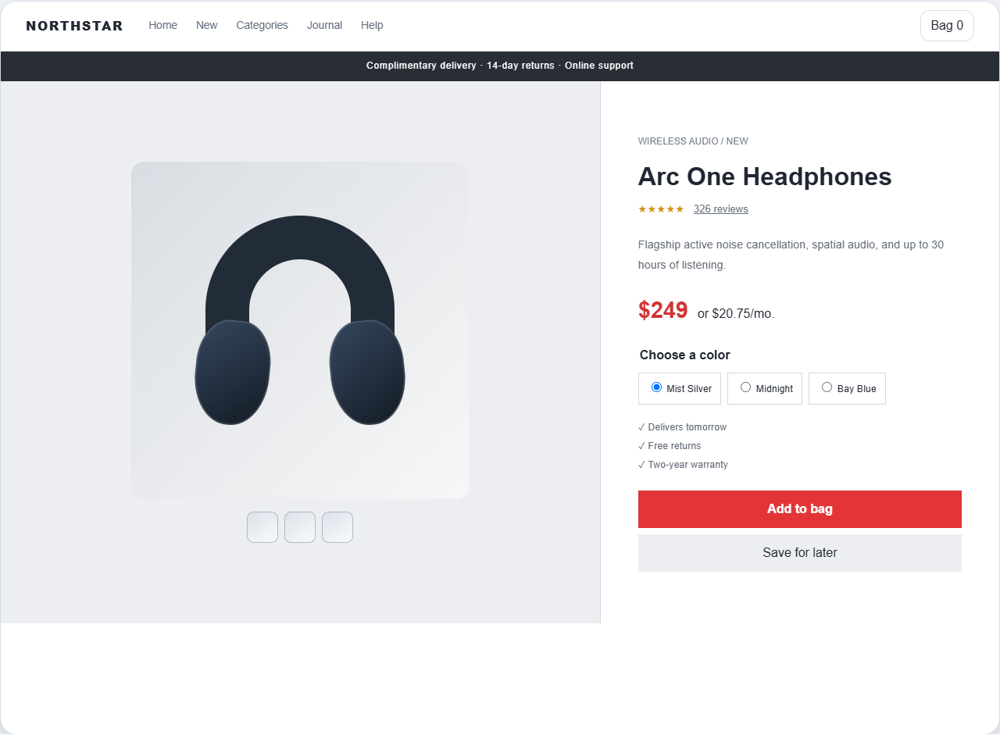</td>
    <td>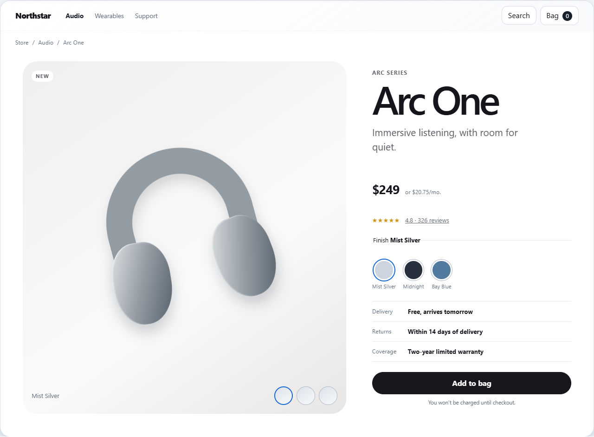</td>
  </tr>
</table>

#### Operations dashboard

<table>
  <tr><th width="50%">Before · equal-weight metrics</th><th width="50%">After · decision and exception focus</th></tr>
  <tr>
    <td>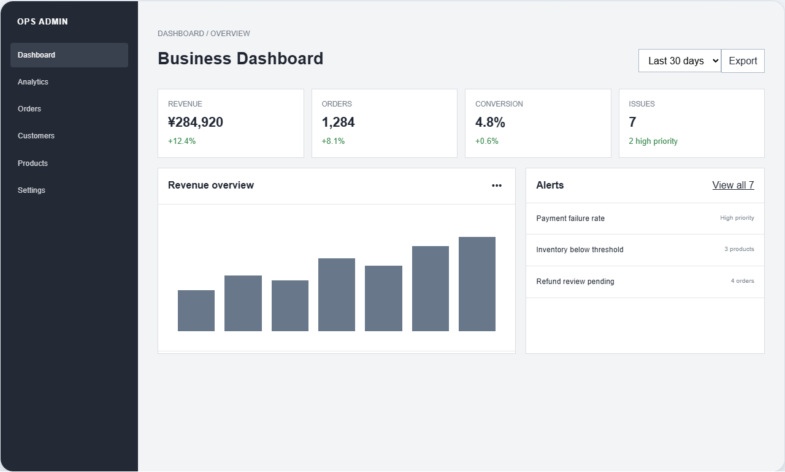</td>
    <td>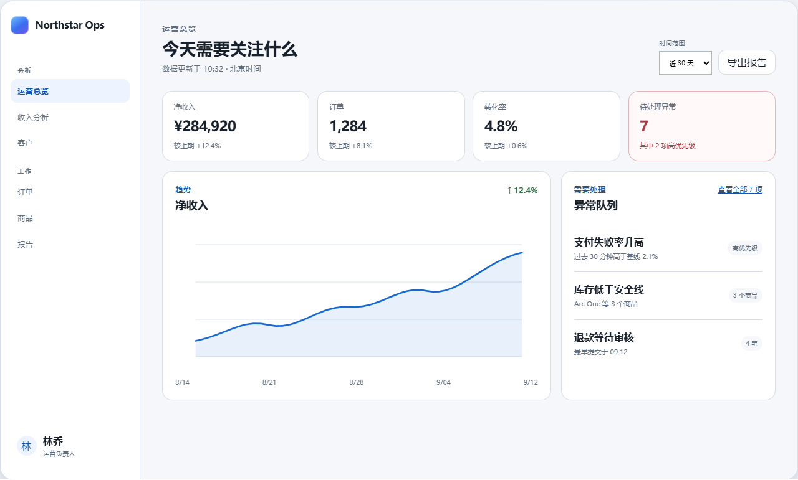</td>
  </tr>
</table>

#### Content editor

<table>
  <tr><th width="50%">Before · administrative form</th><th width="50%">After · persistent editing context</th></tr>
  <tr>
    <td>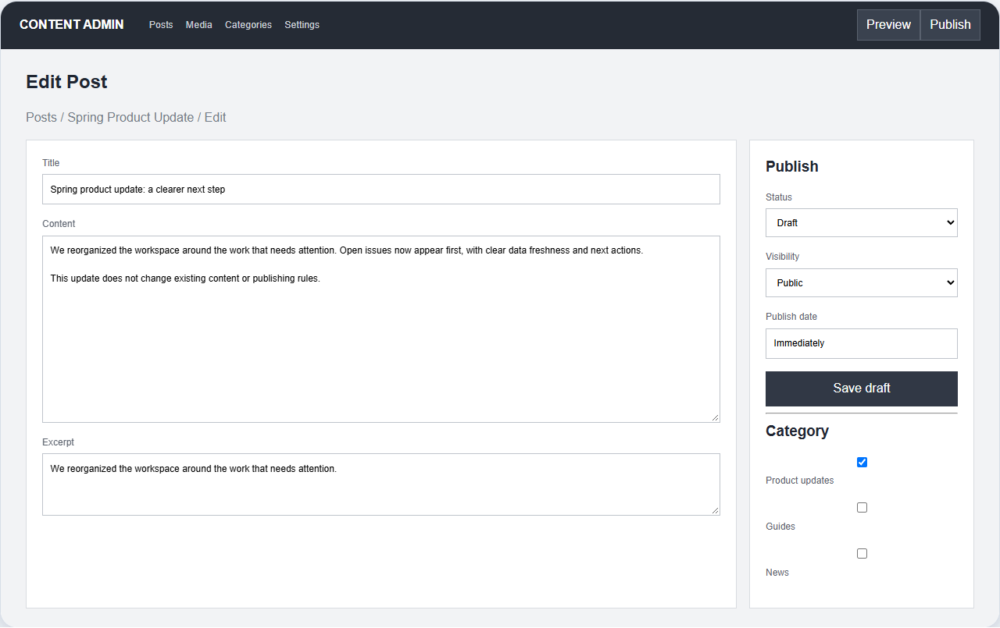</td>
    <td>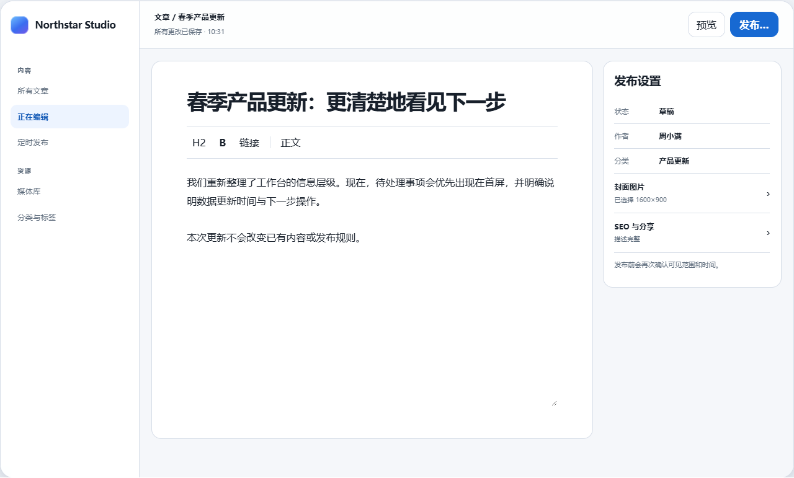</td>
  </tr>
</table>

#### Mobile daily planner

<table>
  <tr><th width="50%">Before · modal task form</th><th width="50%">After · focused task sheet</th></tr>
  <tr>
    <td>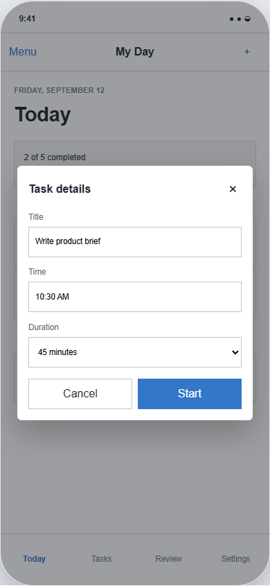</td>
    <td>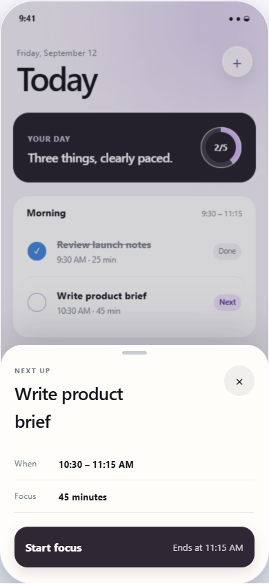</td>
  </tr>
</table>

#### Card components

A cream catalog becomes a graphite workspace: serif to sans-serif typography, satin or matte materials, featured/supporting cards, progress, and contextual disclosure.

<table>
  <tr><th width="50%">Before · cream catalog</th><th width="50%">After · graphite workspace</th></tr>
  <tr>
    <td>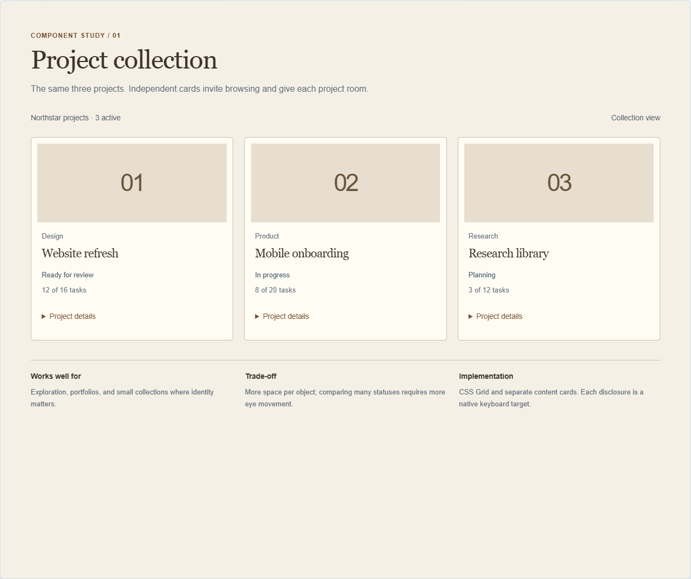</td>
    <td>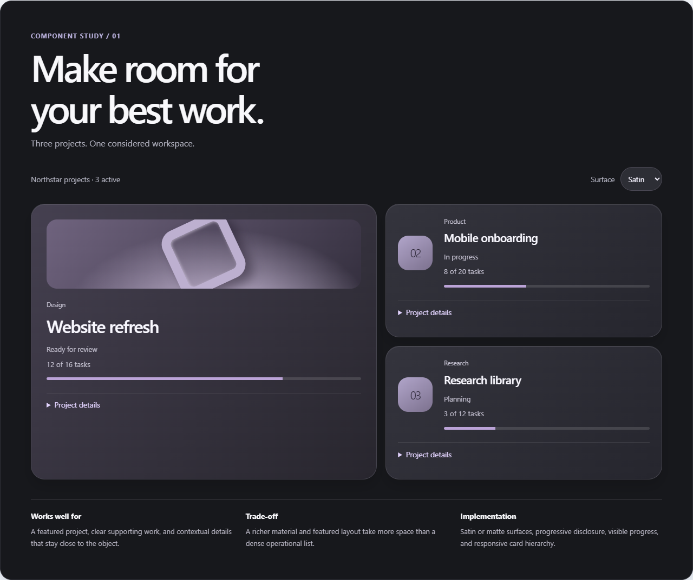</td>
  </tr>
</table>

#### Data chart components

A conventional report becomes an editorial data canvas: new typography, surface hierarchy, green chart language, and keyboard-operable channel inspection. Revenue / Orders and the exact data table stay synchronized.

<table>
  <tr><th width="50%">Before · report panel</th><th width="50%">After · interactive data canvas</th></tr>
  <tr>
    <td>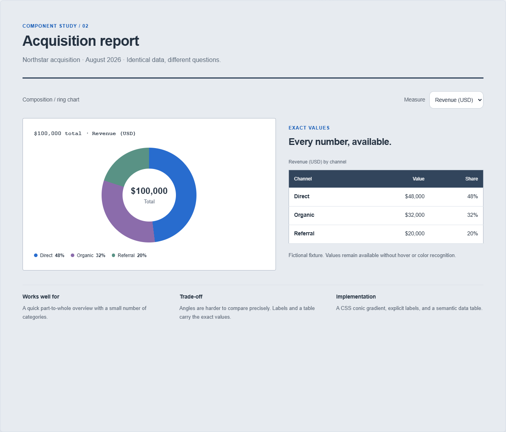</td>
    <td>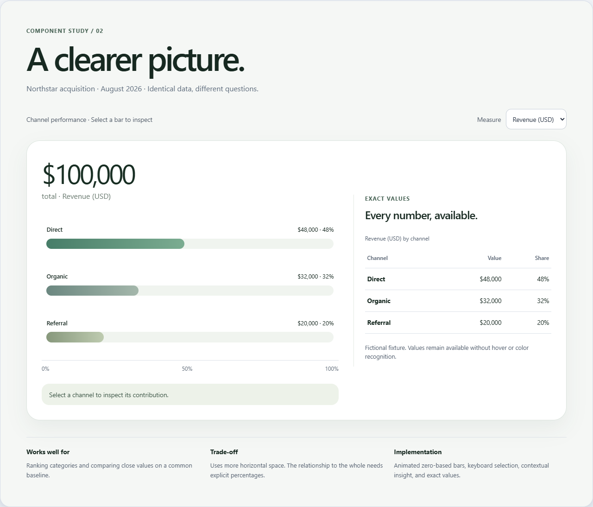</td>
  </tr>
</table>

Read the [comparison trade-offs](skills/apple-design/references/component-comparisons.md). These are complete authored redesigns across typography, material, composition, interaction, and identity. Core data and tasks are preserved.

These are verified browser implementations, not Apple UI replicas, official endorsements, native-platform evidence, or before/after screenshots of the upstream products.

## Reference library

| Layer | Guide | Use it for |
| --- | --- | --- |
| Principles | [Product principles and platforms](skills/apple-design/references/product-platforms.md) | Purpose, agency, familiarity, and Apple platform baselines |
| Foundations | [Visual foundations](skills/apple-design/references/hig-foundations.md) | Layout, materials, color, type, icons, motion, and writing |
| Patterns | [Interaction patterns](skills/apple-design/references/hig-patterns.md) | Navigation, forms, state, feedback, and data protection |
| Components | [Component guidance](skills/apple-design/references/hig-components.md) | Navigation containers, toolbars, controls, and content organization |
| Inputs | [Input and accessibility](skills/apple-design/references/input-accessibility.md) | Keyboard, pointer, gesture, assistive technology, and text scaling |
| Technologies | [Technology experiences](skills/apple-design/references/technology-experiences.md) | AI, sync, sharing, identity, media, and system integrations |
| Pages | [Page design playbook](skills/apple-design/references/page-playbook.md) | Concrete page contracts, flows, edge states, and recovery |
| Behavior | [Component contracts](skills/apple-design/references/component-contracts.md) | States, properties, focus, validation, overlays, and feedback |
| Adaptation | [Cross-platform playbook](skills/apple-design/references/cross-platform-playbook.md) | Shared boundaries, layout changes, and native conventions |
| Implementation | [Code implementation and acceptance](skills/apple-design/references/code-implementation.md) | Vue, React, HTML, semantic tokens, and product refinement |
| Delivery | [Design delivery](skills/apple-design/references/design-delivery.md) | Prompt patterns, review records, and verification reports |
| Governance | [Design-state governance](skills/apple-design/references/design-governance.md) | Protect approved designs, reuse existing systems, and bound exploration |
| Output | [Delivery contract](skills/apple-design/references/output-contract.md) | A concise, reviewable record for multi-surface work |
| Design tooling | [Figma workflow](skills/apple-design/references/figma-workflow.md) | Design-file organization and developer handoff |
| Cases | [Documented product cases](skills/apple-design/references/case-studies.md) | Reusable information relationships with evidence and platform boundaries |
| Marketing | [Marketing-page boundary](skills/apple-design/references/marketing-pages.md) | Explicit marketing-page work, not application workspace design |
| Maintenance | [Sources and coverage](skills/apple-design/references/sources.md) | Official entry points, research limits, and update practice |

The guides are currently written in Simplified Chinese. Technical identifiers, commands, filenames, platform names, and interface semantics remain unchanged.

The [v0.2 development plan](ROADMAP.md) tracks the shipped anti-drift contract and evaluation kit, plus the deliberately deferred English entry, Figma expansion, native evidence, and contributor automation work.

## Interaction lab

The original interaction lab demonstrates list selection, title editing, validation, simulated save failure, retry, unsaved-change protection, and focus restoration. It also provides dark appearance and reduced-transparency controls. The lab is an executable engineering example and is separate from the AI-generated hero illustration.

Start a local static server from the repository root with Python 3, or use an existing static-file server:

```sh
python -m http.server 18542 --bind 127.0.0.1 --directory skills/apple-design/examples/interaction-lab
```

Open <http://127.0.0.1:18542> and follow the [interaction-lab walkthrough](skills/apple-design/examples/interaction-lab/README.md). Stop the server with Ctrl+C. The ES modules require HTTP; direct `file://` opening is not supported.

All tasks are fictional and state exists only in memory. Refreshing resets the example. It does not implement production persistence, authorization, synchronization, or concurrent-edit conflict handling.

The [Web refactor gallery](skills/apple-design/examples/refactor-gallery/README.md) is a second dependency-free example. Run it on port `18543`, or regenerate and verify all twelve comparison screenshots with `npm run test:gallery`.

## Validation

Installing the Skill requires neither Node.js nor Python. Repository checks require Node.js 22 or later. The browser check additionally uses the locked Playwright Core development dependency and a locally installed Chrome, Edge, or Chromium executable.

```powershell
npm ci
npm run check
npm test
npm run test:portable
npm run test:evaluations

# Optional rendered interaction check; no browser is downloaded.
$env:BROWSER_EXECUTABLE = 'C:/Program Files (x86)/Microsoft/Edge/Application/msedge.exe'
npm run test:browser
npm run test:gallery
```

### Current evidence

Verified locally on 2026-09-12:

| Check | Result and boundary |
| --- | --- |
| Package integrity | Local links, license notices, personal-path rules, asset boundary, and Skill entry passed; this is not a full security audit |
| Model tests | 4 passed: interaction-lab title/save/failure behavior plus gallery route normalization |
| Portability | Relocated package checked without optional host metadata; run `npm run test:portable` |
| Behavior evaluation kit | Six rubric-backed scenarios cover locked designs, existing systems, exploration, failure recovery, platform proof, and source boundaries; `npm run test:evaluations` validates the kit rather than grading another model |
| Browser interaction | Passed on Windows with Edge Chromium 153.0.4234.32; covered validation, draft preservation, unsaved-close protection, and focus restoration |
| Refactor gallery | Passed on Windows with Edge Chromium 153.0.4234.32; generated 12 screenshots and covered selection, cart feedback, date range, issue selection, autosave, publish confirmation, focus restoration, card disclosures, material switching, and synchronized chart metrics |
| Layout and display | Passed at 1440, 390, and 320 CSS-pixel widths, with long text, 200% CSS text, dark opaque mode, and forced colors |
| Runtime errors | 0 page errors and 0 console errors in both browser checks |
| Not verified | Safari, Firefox, manual screen-reader use, native shells, simulators, or physical devices; no accessibility certification is claimed |

Interaction-lab diagnostics are written to the ignored `artifacts/` directory; gallery comparisons are regenerated in the tracked `skills/apple-design/assets/case-studies/refactor-gallery/` directory. `npm ci` downloads the locked development dependency; the tests reuse a local Chromium browser and do not download a browser or call paid services. The package is marked `private: true` to prevent accidental npm publication; this does not affect the public GitHub repository.

## Repository structure

```text
Apple-Design/
├── README.md / README.zh-CN.md  English primary documentation and Chinese version
├── LICENSE                      Upstream and new-contribution license notices
├── RELEASE_CHECKLIST.md         Release gates and verification record
├── assets/                      Hero artwork and generation prompts
├── skills/apple-design/
│   ├── SKILL.md                 Agent entry point and reference router
│   ├── agents/openai.yaml       Optional host UI metadata
│   ├── LICENSE / PROVENANCE.md  Redistributed license and source history
│   ├── references/              18 task-specific guides
│   ├── evaluations/             Six maintainable agent-behavior scenarios
│   └── examples/                 Interaction lab and six-case comparison gallery
├── research/                     Open-source prototype selection record
├── scripts/                     Package and rendered-browser checks
└── tests/                       Interaction-model tests
```

## Contributing

Reproducible interaction issues, stale sources, and documented platform differences are welcome as Issues or focused Pull Requests.

- Documentation changes should identify the applicable platform, primary source, and verification date. Keep official guidance separate from project-authored engineering interpretation; do not submit bulk copies or full translations of Apple documentation.
- Example changes should describe the user flow, failure behavior, and verification method. Do not include real user data, secrets, Apple fonts, official screenshots, or unlicensed assets.
- Code changes should run `npm run check`, `npm test`, `npm run test:portable`, and `npm run test:evaluations`; run `npm run test:browser` for interaction-lab changes and `npm run test:gallery` for refactor-gallery changes. State which platforms remain unverified.
- System behavior, measurements, and resource terms can change. Recheck the relevant primary source instead of treating the example's colors, radii, breakpoints, or CSS blur values as Apple requirements.

The current project version is declared in `package.json`. Release tags should point to an actually verified commit. Neither the hero image nor a passing Web check implies compatibility with every agent host or native platform.

## Sources, attribution, and license

Apple-Design uses primary Apple design documentation as a reference layer, including [Apple Design][apple-design], [Design Pathway][apple-pathway], the [Human Interface Guidelines][apple-hig], [Design Resources][apple-resources], and the HIG sections for [Foundations][apple-foundations], [Patterns][apple-patterns], [Components][apple-components], [Inputs][apple-inputs], and [Technologies][apple-technologies]. Apple documentation remains authoritative; summaries in this repository are independent interpretations, not official translations.

The project derives from [`SudewaJay/apple-design-skill`][upstream] at the upstream revision recorded in [`PROVENANCE.md`](skills/apple-design/PROVENANCE.md). The original MIT copyright and license notice are retained, and this repository identifies its rewritten guidance, original engineering playbooks, runnable example, and generated artwork. It must not be represented as having no upstream relationship.

The repository [MIT License](LICENSE) applies only to material the contributors have the right to license. It does not license Apple documentation, trademarks, fonts, icons, screenshots, design resources, or other third-party assets. Read the complete [source and authorization boundary](skills/apple-design/PROVENANCE.md), [coverage index](skills/apple-design/references/sources.md), and [release record](RELEASE_CHECKLIST.md). This documentation is not legal advice and does not guarantee zero risk in every jurisdiction.

### Primary references

1. Apple, [Design][apple-design].
2. Apple, [Design Pathway][apple-pathway].
3. Apple, [Human Interface Guidelines][apple-hig].
4. Apple, [Design Resources][apple-resources].
5. Apple, [HIG: Foundations][apple-foundations].
6. Apple, [HIG: Patterns][apple-patterns].
7. Apple, [HIG: Components][apple-components].
8. Apple, [HIG: Inputs][apple-inputs].
9. Apple, [HIG: Technologies][apple-technologies].
10. Apple, [Guidelines for Using Apple Trademarks and Copyrights][apple-trademark-guidelines].

Last source review: **2026-09-11**. See the [coverage index](skills/apple-design/references/sources.md) for the distinction between indexed topics and guidance verified in detail.

[apple-design]: https://developer.apple.com/design/
[apple-pathway]: https://developer.apple.com/design/get-started/
[apple-hig]: https://developer.apple.com/design/human-interface-guidelines/
[apple-resources]: https://developer.apple.com/design/resources/
[apple-foundations]: https://developer.apple.com/design/human-interface-guidelines/foundations
[apple-patterns]: https://developer.apple.com/design/human-interface-guidelines/patterns
[apple-components]: https://developer.apple.com/design/human-interface-guidelines/components
[apple-inputs]: https://developer.apple.com/design/human-interface-guidelines/inputs
[apple-technologies]: https://developer.apple.com/design/human-interface-guidelines/technologies
[apple-trademark-guidelines]: https://www.apple.com/legal/intellectual-property/guidelinesfor3rdparties.html
[upstream]: https://github.com/SudewaJay/apple-design-skill
