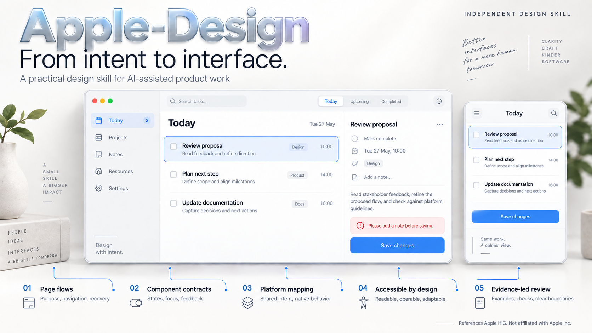

# Apple-Design

[English](README.md) · **简体中文**



**把设计原则变成可执行的页面、组件与交互。**

From intent to interface. · 中文设计实践 · 14 份参考手册 · 可运行交互示例

参考 Apple Human Interface Guidelines 的独立设计实践 Skill。提供中文要点、原创案例、跨平台决策和可运行示例，用于辅助 AI 进行产品设计、审查与实现。

这是独立项目，未由 Apple Inc. 授权、赞助或认可。宣传图是 AI 生成概念示意，不是正式产品截图。Apple 及相关名称属于其权利人。

## 为什么使用 Apple-Design

“做得像 Apple”不是完整的设计需求。Apple-Design 将参考原则落到具体问题：页面首先表达什么、用户下一步做什么、组件如何响应、失败后如何恢复，以及同一个任务在不同平台上如何保持连贯。

它适合产品设计师、独立开发者及使用 AI Agent 的团队，尤其适合已有应用的交互审查、核心页面设计和共享组件优化。它是一套设计工作方法与参考资料，不是组件库、应用模板，也不是一键换肤工具。

工作顺序是：理解现有产品 → 选择相关参考 → 设计主流程与状态 → 映射目标平台 → 用实际交互验收。已有品牌、功能边界和已批准设计始终优先，不因追求某种风格扩大产品范围。

## 从哪里开始

| 你在做什么 | 阅读 |
| --- | --- |
| 希望 AI 使用这套方法 | [Skill 入口](skills/apple-design/SKILL.md) |
| 设计主要页面与完整流程 | [页面手册](skills/apple-design/references/page-playbook.md) |
| 设计组件状态和行为 | [组件契约](skills/apple-design/references/component-contracts.md) |
| 同一功能落地不同平台 | [跨平台手册](skills/apple-design/references/cross-platform-playbook.md) |
| 获取可复用请求和交付格式 | [设计交付](skills/apple-design/references/design-delivery.md) |
| 运行一个真实交互示例 | [交互实验](skills/apple-design/examples/interaction-lab/README.md) |
| 查看研究范围与未穷尽内容 | [来源索引](skills/apple-design/references/sources.md) |

## 包含什么

- 页面：任务工作区、搜索与筛选、创建/编辑、日历、设置、首次使用、详情/阅读/专注，以及空、错误、等待和恢复状态。
- 组件：按钮、输入、选择、列表、导航、浮层和反馈；不止默认外观，还包括焦点、键盘、属性归属、校验和降级。
- 平台：iOS/iPadOS/macOS 的设计语境，以及 Windows、Android、Web 的工程映射；共享语义，不强求逐像素复制。
- 基础：材质、层级、字体、色彩、图标、文案、动效、包容与可访问性。
- 证据：一个无运行依赖的 HTML/CSS/JS 实验、Node 测试和可选浏览器验收。

采用渐进阅读：入口保持简短，按任务加载参考。它不是 Apple 官方文档翻译包，也不是像素尺寸大全。

## 安装到 Codex

先克隆仓库，或在 GitHub 使用 **Code → Download ZIP** 并解压：

```sh
git clone https://github.com/Shiaoming123/Apple-Design.git
cd Apple-Design
```

将完整的 `skills/apple-design` 文件夹复制到用户的 Skills 目录。不要只复制 `SKILL.md`：它依赖相邻的参考和示例。保留文件夹内的 LICENSE 和 PROVENANCE.md。若已有同名 Skill，先备份并比较，不直接覆盖未知修改。

Windows PowerShell 可在仓库根目录执行以下安装命令；目标已存在时会停止，不覆盖：

```powershell
$skillRoot = if ($env:CODEX_HOME) {
  Join-Path $env:CODEX_HOME 'skills'
} else {
  Join-Path ([Environment]::GetFolderPath('UserProfile')) '.codex/skills'
}
$skillTarget = Join-Path $skillRoot 'apple-design'
if (Test-Path -LiteralPath $skillTarget) { throw '同名 Skill 已存在，请先备份并比较。' }
New-Item -ItemType Directory -Path $skillRoot -Force | Out-Null
Copy-Item -LiteralPath './skills/apple-design' -Destination $skillTarget -Recurse
```

默认目录通常为 `~/.codex/skills/apple-design`；若配置了 CODEX_HOME，则使用其 skills 子目录。重新载入会话后可使用：

```text
使用 $apple-design 为现有任务产品设计“今天”页面。
保留品牌与信息架构，输出主流程、错误恢复、组件契约、
宽窄窗口差异与验收步骤；不增加未经请求的功能。
```

本地既有调用名仍是 `$apple-design`。其他 Agent 的 Skills 目录与加载方式以该工具配置为准，不宣称全部宿主均已测试。

## 三种典型用法

给 Agent 提供现有页面、代码或截图，并说明目标平台、用户任务和不可改动的约束。以下请求可以直接改写使用。

### 1. 设计主要页面

```text
使用 $apple-design 设计学习产品的“今天”页面。
目标：用户能发现当前学习任务，并快速继续上次进度。
平台：手机触摸与可调整窗口的桌面端。
保留现有导航与品牌。先交付信息层级、主流程、空/加载/错误状态、
宽窄布局与键盘路径；设计确认前不要实现代码。
```

### 2. 审查并优化现有组件

```text
使用 $apple-design 检查现有编辑弹窗及共享 Input、Button 组件。
关注字段标签、校验、失败保留输入、未保存退出保护和焦点恢复。
先读取真实调用者；在已授权范围内做最小修复，保留业务语义。
交付问题证据、修改文件和可复现的验证步骤。
```

### 3. 规划跨平台实现

```text
使用 $apple-design 为同一列表—详情流程制定 iPadOS、Windows 和 Web 方案。
分别说明可共享的领域状态与设计 token，以及导航、快捷键、
窗口适配和系统反馈的差异。不更换现有技术栈。
区分官方建议与工程映射，列出尚需原生环境验证的项目。
```

一次有效交付应能回答：改进哪个任务、依据什么证据、改变哪些状态与行为、如何恢复失败、在哪个环境验证。无需为简单调整强制生成长篇设计文档；更多请求模板见[设计交付指南](skills/apple-design/references/design-delivery.md)。

## 完整参考目录

| 层次 | 文档 | 主要用途 |
| --- | --- | --- |
| 原则 | [产品原则与平台](skills/apple-design/references/product-platforms.md) | 目的、自主、熟悉性及各平台体验基线 |
| 基础 | [视觉基础](skills/apple-design/references/hig-foundations.md) | 布局、材质、色彩、字体、图标、动效与文案 |
| 流程 | [交互模式](skills/apple-design/references/hig-patterns.md) | 导航、状态、表单、反馈与数据保护 |
| 控件 | [组件指南](skills/apple-design/references/hig-components.md) | 导航容器、工具栏、控件与内容组织 |
| 输入 | [输入与可访问性](skills/apple-design/references/input-accessibility.md) | 键盘、指针、手势、辅助技术与文字放大 |
| 集成 | [技术体验](skills/apple-design/references/technology-experiences.md) | AI、同步、分享和系统集成的体验边界 |
| 页面 | [页面设计手册](skills/apple-design/references/page-playbook.md) | 从目标、主流程到异常恢复的具体页面案例 |
| 行为 | [组件契约](skills/apple-design/references/component-contracts.md) | 状态、属性、焦点、校验和交互约定 |
| 适配 | [跨平台手册](skills/apple-design/references/cross-platform-playbook.md) | 共享边界、布局切换与平台特有行为 |
| 实现 | [代码实现与验收](skills/apple-design/references/code-implementation.md) | Vue/React/HTML、语义 token 与产品优化 |
| 交付 | [设计交付指南](skills/apple-design/references/design-delivery.md) | 请求模板、评审记录与验证报告 |
| 设计工具 | [Figma 工作流](skills/apple-design/references/figma-workflow.md) | 设计文件与开发交接 |
| 营销 | [营销页面](skills/apple-design/references/marketing-pages.md) | 仅用于明确要求的营销页面，不替代应用工作区设计 |
| 维护 | [来源与覆盖范围](skills/apple-design/references/sources.md) | 官方入口、研究边界与更新方式 |

## 运行交互示例

示例展示列表选择、标题编辑、校验、模拟保存失败、重试及焦点返回，并提供深色与减少透明度切换。它是可操作的工程示例，与顶部的 AI 概念图并非同一套界面。

从仓库根目录启动本地静态服务（需 Python 3；也可使用已有静态服务器）：

```sh
python -m http.server 18542 --bind 127.0.0.1 --directory skills/apple-design/examples/interaction-lab
```

打开 <http://127.0.0.1:18542>，按[实验步骤](skills/apple-design/examples/interaction-lab/README.md)操作；结束时在终端按 Ctrl+C。ES 模块需要 HTTP 服务，不保证直接双击 HTML 可用。

所有任务都是虚构数据，修改仅在内存中，刷新即重置。示例没有生产持久化、权限管理、同步或并发冲突处理。

## 验证与预览

安装 Skill 不需要 Node 或 Python。运行开发检查才需要 Node 22+；浏览器测试另需 Playwright Core 和本机浏览器。

```powershell
node scripts/check-package.mjs
node --test tests/model.test.mjs
npm ci
# 指向本机 Chrome/Edge 可执行文件；不下载浏览器
$env:BROWSER_EXECUTABLE = 'C:/Program Files (x86)/Microsoft/Edge/Application/msedge.exe'
npm run test:browser
```

交互预览见示例目录的 README。测试数据只在内存；模拟失败不是生产网络。Windows/Edge 结果不代表 SwiftUI、WinUI、Compose 或真机通过。

### 已验证与未验证

2026-09-11 的本地验证记录：

| 检查 | 结果与边界 |
| --- | --- |
| 发布包 | 本地链接、许可声明、个人路径规则、资源边界与 Skill 入口检查通过；不等同于完整安全审计 |
| 模型测试 | 3 项通过：标题边界、保存结果、失败与重试 |
| 浏览器交互 | Windows / Edge Chromium 152.0.4191.66 通过；覆盖校验、失败保留草稿、未保存关闭保护和焦点恢复 |
| 显示与适配 | 1440 / 390 / 320 CSS px 宽度、长文本、200% CSS 文字、深色不透明与强制颜色检查通过 |
| 运行错误 | 浏览器验收中 page error 与 console error 均为 0 |
| 尚未验证 | Safari、Firefox、屏幕阅读器人工验收、原生壳、模拟器与真机；未获得无障碍合规认证 |

截图由浏览器检查写入 `artifacts/`，该目录不入库。执行 `npm ci` 会获取锁定的开发依赖；测试复用本机 Chromium 浏览器，不自动下载浏览器，也不启动付费服务。`package.json` 的 `private: true` 用于避免误发 npm，不影响 GitHub 仓库公开。

## 仓库结构

```text
Apple-Design/
├── README.md / README.zh-CN.md 英文主文档与中文版本
├── LICENSE                     上游及新增贡献的许可声明
├── RELEASE_CHECKLIST.md         发布门槛与复核记录
├── assets/                     宣传图与生成提示词
├── skills/apple-design/
│   ├── SKILL.md                Agent 入口
│   ├── agents/openai.yaml      Codex 展示元数据
│   ├── LICENSE / PROVENANCE.md  随 Skill 分发的许可与来源
│   ├── references/             14 份按需读取的参考
│   └── examples/interaction-lab/  无运行依赖的交互示例
├── scripts/                    发布包及浏览器检查
└── tests/                      示例模型测试
```

## 贡献与维护

欢迎通过 Issue 报告可复现的交互问题、失效来源或平台差异，并通过 Pull Request 提交有证据的小范围改进。

- 文档变更：给出适用平台、官方来源及核对日期，区分官方建议和项目的工程解释；不要提交官方文档的批量复制或全量翻译。
- 示例变更：说明用户流程、失败状态及验证方式；不要提交真实用户数据、密钥、官方字体或未获许可的资源。
- 代码变更：运行 `npm run check`、`npm test`，涉及可见交互时再运行 `npm run test:browser`；记录未验证的平台。
- 系统行为、尺寸或资源条款可能变化。维护时以对应官方来源为准，不把示例中的色值、圆角、断点或 CSS 模糊参数当作 Apple 的统一标准。

版本以 `package.json` 为准。正式标签应指向实际已验证提交；本项目不以宣传图或测试通过推断所有宿主和平台均受支持。

## 许可证与来源

项目源自 [SudewaJay/apple-design-skill](https://github.com/SudewaJay/apple-design-skill)，保留 Sudewa 的 MIT 版权与许可，并加入中文重写、原创工程手册和示例。不是从零无上游项目。

[MIT](LICENSE) 仅覆盖贡献者有权许可的项目内容，不许可 Apple 文档、商标、字体、图标或其它第三方资产。名称 Apple-Design 的商标使用风险仍存在；免责声明不是授权。

请阅读 [来源与授权边界](skills/apple-design/PROVENANCE.md) 和 [发布检查](RELEASE_CHECKLIST.md)。版权检查不是法律意见，不承诺所有地区零风险。
