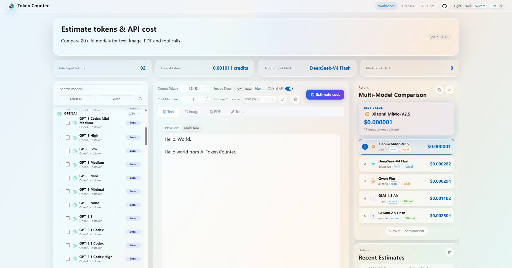

# 案例索引

案例用于回答“哪种信息关系已经在真实产品中工作”，不是可直接套用的皮肤，也不代表 Apple 官方认可。只读取与当前任务相近的案例；实施前仍需检查目标产品的真实流程、组件、平台和可访问性状态。

## 使用规则

- 区分仓库截图、实时网页、概念图和目标平台证据。它们不能互相替代。
- 保留来源网址、获取日期、提交或视口、主题、页面状态和文件哈希；实时网页未证明对应某个仓库提交时，不建立这种关联。
- 提炼信息层级、任务流和状态表达，不复制品牌、色值、圆角、模糊或具体内容。
- 截图只能证明可见状态。键盘、缩放、错误恢复、减少透明度和原生平台行为必须另行验证。

## Tokens Counter：高密度桌面工作台

- 项目：[Shiaoming123/Tokens-Counter](https://github.com/Shiaoming123/Tokens-Counter)
- 在线体验：[tokens-counter.vercel.app](https://tokens-counter.vercel.app/)
- 场景：在一个桌面 Web 工作台中选择多个模型、配置估算参数、输入内容并比较结果。
- 核验日期：2026-09-12（Asia/Shanghai）

### 证据

| 文件 | 类型与状态 | 来源/环境 | SHA-256 |
| --- | --- | --- | --- |
| [`repository/readme-screenshot.png`](../assets/case-studies/tokens-counter/repository/readme-screenshot.png) | 仓库 README 截图；英文、有结果 | 提交 [`758d686`](https://github.com/Shiaoming123/Tokens-Counter/tree/758d6867fdeb58c1bad028382560912f8ca0b76c)，2048×1074 px | `fc9f81f061690c450c106db526dcb82a6e6d8cc83f1682fa623e9a2800547acf` |

在线地址用于复核当前版本，但本案例只保存仓库原始截图，不重复收录视觉差异不明显的实时页面截图。截图只证明可见状态，不替代交互、性能或可访问性验收。

仓库 README 状态：

### 问题—决策—效果—边界

- 问题：模型、参数、输入和结果都需要较高信息密度，但主要任务不能被统计或装饰抢走。
- 决策：把模型选择、估算输入、结果/历史放在稳定三栏中；顶部摘要只承载当前选择与计算结果；本地/官方来源用文字标签表达。
- 可见效果：选择范围、输入上下文和比较结果能在同一视野中往返查看；空结果仍保留下一步入口。
- 边界：这是桌面 Web 工作台的可见证据，不是移动端或原生 Apple 平台证据，也不是可用性研究结论。

### 可复用模式

- 先固定“选择 → 配置与输入 → 结果”的任务关系，再决定材质和装饰。
- 用稳定列和邻近反馈支持频繁比较；窄窗口应改为分层导航，不能机械压缩三栏。
- 可信边界既有独立入口，也在模型条目附近用文字说明，避免只靠颜色或图标。
- 主题、语言和帮助入口在桌面工具栏可见，但视觉权重低于主任务。

### 使用前复核

重新打开在线体验并检查当前布局；若要引用具体行为，应再读对应代码。对浅色渐变、透明材质、细边框和密集顶部导航检查对比度、200% 文字、键盘焦点、减少透明度及较窄桌面窗口。不要把项目自述的“Apple 风格”写成 HIG 合规或 Apple 认证。

## Web 重构画廊：六类页面与组件

- 可运行示例：[Web 重构案例画廊](../examples/refactor-gallery/README.md)
- 场景：商品详情与购买、运营仪表盘、内容编辑器、手机日程规划器、卡片、数据图表。
- 原型来源：[Spree Storefront](https://github.com/spree/storefront)、[shadcn/ui `dashboard-01`](https://ui.shadcn.com/blocks)、[Puck](https://github.com/puckeditor/puck)。三者核验时均以 MIT 许可发布。
- 核验日期：2026-09-12（Asia/Shanghai）

### 证据

以下十二张图片由同一个本地 HTML/CSS/JavaScript 示例在浅色浏览器模式、Windows Edge Chromium 153.0.4234.32 中生成。浏览器视口为 1440×1000 CSS px，手机设备框按其内容截取。每组前后保持相同数据、宽度及归一化后的最小高度，截图时仅隐藏画廊导航避免遮挡原型。卡片 After 的深色是案例自身的视觉设计，不是切换浏览器主题。

| 场景 | 尺寸（每张） | Before SHA-256 | After SHA-256 |
| --- | --- | --- | --- |
| [商品详情](../assets/case-studies/refactor-gallery/commerce/before.png) | 1280×941 | `9c7122fb3c6563598460324811dacffee57b8e7078f3f084ad651309c50938eb` | [`06c4dbaeded21de607c5e71752cb94b9c99b06a2854d6b751a9c180a9cb3147b`](../assets/case-studies/refactor-gallery/commerce/after.png) |
| [数据仪表盘](../assets/case-studies/refactor-gallery/dashboard/before.png) | 1280×849 | `c8e512c3ef23f48056b52ce273e5fd9dba6d9218cddfd8fd9b2b8e8cf375d3ba` | [`a19edb9ce55960d2f30effbc32dd2edb7d409702c4ee6836cd0923759cc56d41`](../assets/case-studies/refactor-gallery/dashboard/after.png) |
| [内容编辑器](../assets/case-studies/refactor-gallery/editor/before.png) | 1280×805 | `6c2653584a6799a08f89ea6f99d899f2d2ba12ef1974296db4852454cdc74968` | [`27f55bef81a67538388bc8c9e56b760ec0fe74df66802bf4ed7c9b3721de2a81`](../assets/case-studies/refactor-gallery/editor/after.png) |
| [手机日程规划器](../assets/case-studies/refactor-gallery/mobile/before.png) | 390×845 | `f278092d08a8a5da4cbfcb6acadca2e6d4d9f0d56da60f92e67f21e15a5fdbf1` | [`3fef452eecd3408bbc58b48ebfcaa610a6448c6ff57a588d70426cb6bb1803c5`](../assets/case-studies/refactor-gallery/mobile/after.png) |
| [卡片](../assets/case-studies/refactor-gallery/cards/before.png) | 1280×1073 | `df1afa6c5944df08f2ac7c61c4bec05d15cf2196f55c015959bf5572704350c0` | [`3e94b1e5bda6c98bca04383271de179d70452a87ea79d18ccb5a8d433247a296`](../assets/case-studies/refactor-gallery/cards/after.png) |
| [数据图表](../assets/case-studies/refactor-gallery/charts/before.png) | 1280×1094 | `517accc62d8ba5008bd8e95abdb834919aacbfd8b192804db573d562e404e85e` | [`580ba6095667b21c537dcd76d39b910d3b33c9872cdf0173409e11df6bac39a4`](../assets/case-studies/refactor-gallery/charts/after.png) |

### 重构关系

- 卡片与图表为项目原创的组件用法比较，详见 [取舍与数据合同](component-comparisons.md)。本轮按字体、材质、排版、交互和视觉风格做完整重设计，保持核心任务与数据。

- 商品详情：从促销和通用导航抢占注意力，改为“商品 → 价格 → 规格 → 履约 → 加入购物袋”的连续购买路径。
- 数据仪表盘：从同权重指标与图表堆叠，改为带更新时间、比较口径、异常优先级和下钻入口的运营决策页。
- 内容编辑器：从字段表单与发布侧栏，改为持续可见的文档上下文、保存状态、编辑画布和发布边界。
- 手机日程规划器：从居中的通用表单弹窗，改为保持日程上下文的底部任务面板，并提供明确的专注态进入与退出路径。

### 来源与边界

开源原型用于选择真实桌面任务结构，手机任务流由项目自制；未把上游应用、商标、图片或在线数据复制进本 Skill。Before 是项目制作的本地适配基线，不是第三方页面原样截图；After 是应用本 Skill 规则后的实际 Web 实现，也不是 Apple 官方设计或原生平台验证。自动检查覆盖 URL 状态、规格选择、购物袋反馈、时间筛选、异常选择、自动保存、发布对话框、手机弹层焦点恢复、专注态进入/暂停/退出、390 px 窄屏、200% CSS 文字以及浏览器控制台错误；未覆盖真实支付、生产数据、持久化、读屏器、Safari、原生壳或设备。

[六组真实浏览器重设计录屏](../assets/case-studies/refactor-gallery/redesign-motion.mp4) 展示版本切换、商品换色、异常详情、专注编辑、手机任务流、卡片展开和图表键盘可操作的选中状态。视频来自实际页面，没有生成概念帧。
